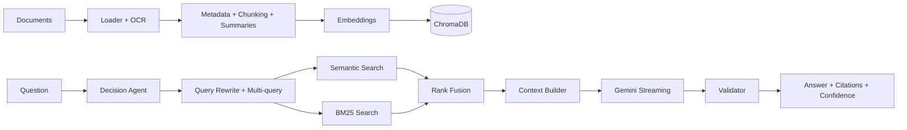

# AI Knowledge Assistant — Full Bonus Edition

## Overview

A production-style Retrieval-Augmented Generation (RAG) assistant that loads company documents, creates embeddings, performs hybrid retrieval, validates Gemini answers, cites sources, remembers the conversation, and generates evaluation reports.

The project implements **all core requirements and all bonus challenges** in AI Track Team Assignment 02.

## Core Features

- Automatic indexing for PDF, DOCX, TXT, Markdown and CSV
- Metadata extraction: document name, page number and chunk number
- Meaningful overlapping chunks
- Sentence Transformer embeddings
- Persistent ChromaDB vector database
- Intelligent query rewriting
- Top-K semantic retrieval, deduplication and context token budget
- Gemini answer generation grounded only in retrieved context
- Post-generation response validation
- Source citations and answer-level confidence
- Conversation memory
- TXT and Markdown conversation export
- 25-question evaluation suite with CSV and Markdown reports

## All Bonus Challenges

| Bonus | Implementation |
|---|---|
| Hybrid Search | Chroma semantic search + BM25 keyword search + Reciprocal Rank Fusion |
| Document summarization during indexing | Extractive summaries indexed beside normal chunks |
| Multi-query retrieval | Up to three complementary queries per question with fused results |
| Confidence scoring | Weighted retrieval evidence combined with validator outcome |
| Streaming AI responses | Enabled by default; toggle with the `stream` command |
| Prompt strategy comparison | Basic vs advanced comparison reports |
| Automatic evaluation reports | 25 end-to-end questions; CSV and Markdown output |
| OCR image-based PDFs | PDFium rendering + Tesseract OCR fallback |
| Simple AI agent | Routes questions to knowledge-base retrieval or conversation memory |

See [`docs/BONUS_FEATURES.md`](docs/BONUS_FEATURES.md) for demonstration details and [`docs/ARCHITECTURE.md`](docs/ARCHITECTURE.md) for the full Mermaid architecture diagram.

## Project Structure

```text
AI-Knowledge-Assistant/
├── data/                       # Sample knowledge base
├── chroma_db/                  # Persistent vector database
├── docs/
│   ├── ARCHITECTURE.md
│   └── BONUS_FEATURES.md
├── evaluation_results/
├── exports/
├── tests/
├── evaluation_questions.json  # 25 evaluation cases
├── src/
│   ├── knowledge_base/
│   │   ├── loader.py           # Includes OCR fallback
│   │   ├── metadata.py
│   │   └── chunker.py
│   ├── decision_agent.py
│   ├── summarizer.py
│   ├── keyword_search.py
│   ├── embeddings.py
│   ├── vector_store.py
│   ├── query_rewriter.py
│   ├── retriever.py            # Hybrid + multi-query retrieval
│   ├── context_builder.py
│   ├── prompt_builder.py
│   ├── generator.py            # Standard + streaming generation
│   ├── validator.py
│   ├── citations.py
│   ├── memory.py
│   ├── export.py
│   ├── evaluation.py
│   ├── evaluation_runner.py
│   ├── prompt_comparison.py
│   └── main.py
├── .env.example
├── requirements.txt
└── README.md
```

## Installation

```powershell
python -m venv venv
venv\Scripts\activate
pip install -r requirements.txt
```

Copy `.env.example` to `.env`:

```env
GOOGLE_API_KEY=YOUR_GEMINI_API_KEY
HF_TOKEN=OPTIONAL_HUGGING_FACE_TOKEN
```

### OCR Setup on Windows

Python OCR packages are included in `requirements.txt`. Tesseract itself is a system program and must also be installed. Install **Tesseract OCR for Windows** and ensure its installation folder is available in the Windows `PATH`. The assistant still works normally for text-based PDFs when Tesseract is not installed; OCR pages simply use the safe fallback.

## Run the Assistant

```powershell
python -m src.main
```

Commands inside the assistant:

```text
exit     stop the program
export   export conversation as TXT and Markdown
clear    clear session memory
reindex  rebuild ChromaDB with summaries and OCR
stream   toggle streaming responses
```

> The included ChromaDB may contain the original chunks. Run `reindex` once after installing the bonus version so document summaries and OCR metadata are added to the index.

## Run All Tests

```powershell
python -m pytest -q
```

## Run the 25-Question Evaluation

```powershell
python -m src.evaluation_runner
```

Generated files:

```text
evaluation_results/evaluation_report.csv
evaluation_results/evaluation_report.md
```

## Compare Prompt Strategies

```powershell
python -m src.prompt_comparison
```

Generated files:

```text
evaluation_results/prompt_strategy_comparison.csv
evaluation_results/prompt_strategy_comparison.md
```

## Architecture



## Team Responsibilities

| Member | Responsibility |
|---|---|
| Member 1 | Loader, Metadata, Chunking, Embeddings |
| Member 2 | Vector Database, Hybrid Retrieval, Query Rewriting, Context Builder |
| Member 3 | Prompt Builder, Gemini Integration, Validation, Memory, Agent |
| Member 4 | Evaluation, Export, Documentation, Testing, GitHub, Jira, Final Integration |
..