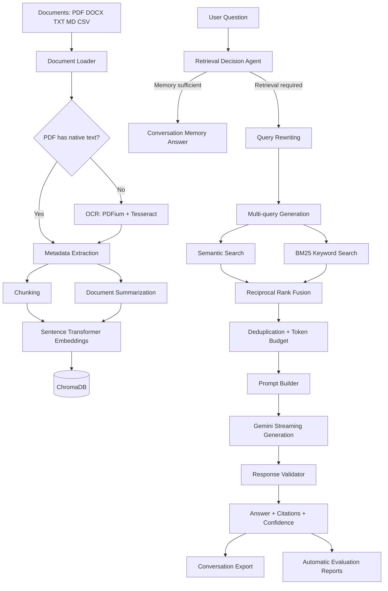

# Architecture Diagram

```mermaid
flowchart TD
    A[Documents: PDF DOCX TXT MD CSV] --> B[Document Loader]
    B --> C{PDF has native text?}
    C -- No --> D[OCR: PDFium + Tesseract]
    C -- Yes --> E[Metadata Extraction]
    D --> E
    E --> F[Chunking]
    E --> G[Document Summarization]
    F --> H[Sentence Transformer Embeddings]
    G --> H
    H --> I[(ChromaDB)]

    Q[User Question] --> J[Retrieval Decision Agent]
    J -- Memory sufficient --> K[Conversation Memory Answer]
    J -- Retrieval required --> L[Query Rewriting]
    L --> M[Multi-query Generation]
    M --> N[Semantic Search]
    M --> O[BM25 Keyword Search]
    N --> P[Reciprocal Rank Fusion]
    O --> P
    P --> R[Deduplication + Token Budget]
    R --> S[Prompt Builder]
    S --> T[Gemini Streaming Generation]
    T --> U[Response Validator]
    U --> V[Answer + Citations + Confidence]
    V --> W[Conversation Export]
    V --> X[Automatic Evaluation Reports]
```
